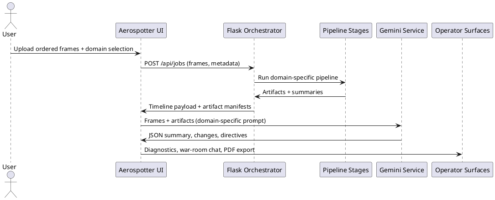
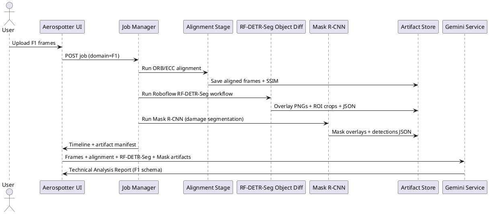
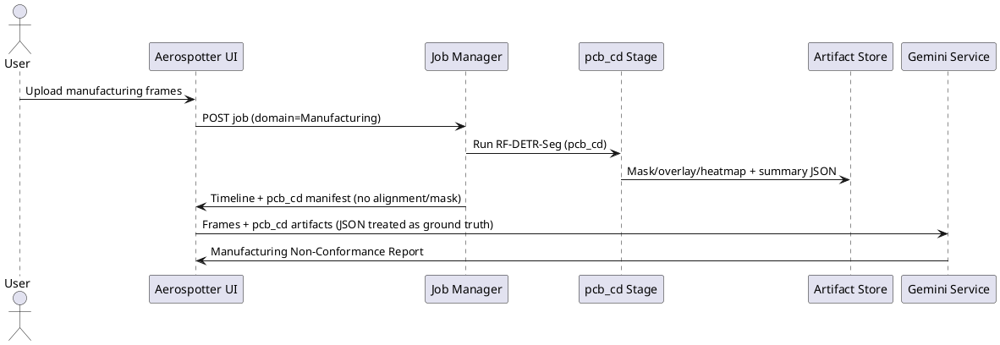
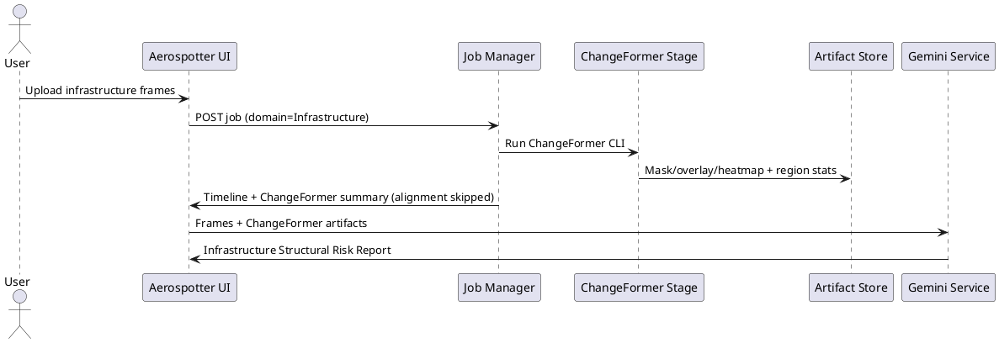

# trackshift visual difference stack

## what we built

- unified ingest + analysis stack that routes every job through a domain-aware pipeline (F1, Manufacturing, Infrastructure) and streams artifacts back to the operator ui
- flask-based orchestrator that selectively runs SSIM alignment + Roboflow + Mask R-CNN for F1, RF-DETR-Seg (pcb_cd) for Manufacturing, and ChangeFormer change detection for Infrastructure
- frontend diagnostics, war-room chat, and export surfaces that stay in lockstep with the timeline plus domain-specific Gemini reports and PDF exports

## ingestion and preprocessing

- the vite/ui app collects ordered frames (or auto-extracted video stills) with domain + comparison mode metadata and posts them to the orchestrator
- job manager writes each upload under `data/jobs/<job-id>` and preserves frame order so downstream diffs map back to the exact frame indexes rendered in the timeline carousel
- F1 jobs run ORB+homography with ECC fallback before heavy stages; Manufacturing and Infrastructure skip alignment entirely and rely on raw frames plus change-detector overlays
- alignment feasibility heuristics short circuit impossible F1 pairs so gpu time is not wasted on wildly different aspect ratios
- every raw frame path is stored alongside the derived artifacts so Gemini can ingest both originals and model outputs per domain

## detection and segmentation stack

- F1 pipeline: SSIM scores (post-alignment) feed severity ordering, Roboflow object diff (RF-DETR-Seg) emits overlays + ROI crops + JSON, and Mask R-CNN adds damage overlays when detections clear the 0.85 confidence gate
- Manufacturing pipeline: pcb_cd (RF-DETR-Seg) consumes before/after frames directly, outputs mask/overlay/heatmap plus a JSON manifest treated as the ground-truth defect ledger for Gemini
- Infrastructure pipeline: ChangeFormer CLI wrapper produces mask/overlay/heatmap plus coverage + region stats, giving Gemini localized stress signals without alignment or Mask R-CNN
- all artifact directories are normalized so diagnostics, PDF export, and Gemini ingest can iterate through deterministic paths without missing thumbnails
- optical-flow derived masks are still available for F1 runs when we need to down-weight mechanic motion or trackside clutter before higher-cost models fire

## backend orchestration logic

- `pipeline/stages.py` now branches per domain: it skips alignment entirely for Manufacturing/Infrastructure, runs pcb_cd for Manufacturing, ChangeFormer for Infrastructure, and RF-DETR-Seg + Mask R-CNN for F1 jobs
- alignment skip payloads document the reason ("Alignment disabled for manufacturing domain" etc.) so downstream consumers never expect absent artifacts
- `pipeline/jobs.py` persists every per-pair result (including raw frame paths) into a timeline entry; failures bubble up with full stdout/stderr for debugging
- artifact urls are rewritten through `/api/jobs/<id>/artifacts/...` so the frontend hotlinks assets without touching the filesystem

## frontend + operator workflow

- `useVisionProcessor` handles uploads, streams progress updates, and orchestrates Gemini runs; it always forwards before/after frames plus every available artifact so Manufacturing and Infrastructure mirror the F1 UX
- timeline carousel keeps drag-and-drop order stable by cloning the framer-motion payload, so preview urls survive user reordering
- diagnostics panel renders comparison cards with Roboflow overlays, Mask maps, ChangeFormer outputs, and pcb_cd heatmaps—each gated by availability to avoid broken links
- war-room chat + crew summary modules subscribe to the shared `AnalysisResult`, so anything the backend detects (SSIM scores, ChangeFormer regions, pcb_cd defects) is referenceable in chat replies and exports
- export panel reuses the artifact digest when building PDF narratives, guaranteeing parity between what ops sees live and what leadership reads later

## ai reasoning + debate safety nets

- `geminiService.ts` owns every LLM touchpoint: image analysis, foresight generation, PDF drafting, speech synthesis, grounded search, debate, and setup sheets
- analysis prompts + PDF directives are domain-specific: Manufacturing yields a "Manufacturing Non-Conformance Report", Infrastructure renders an "Infrastructure Structural Risk Report", and F1 keeps the original "Technical Analysis Report"
- before any final reply, `generateDebateAndAnswer` stages an internal Aero Shourya vs. Aero Varun debate and only surfaces Aero Sameel's consolidated answer to reduce hallucinations
- Manufacturing runs include a JSON fallback so Gemini can still build a defect manifest if imagery cannot be sent (e.g., due to compression limits)

## image handoff to llm

- after backend inference, the ui zips ordered frames + metadata into `GeminiImageInput[]`, labels each part (baseline, frame n, before/after), and streams them through `fileToGenerativePart`
- the frontend also attaches per-domain artifacts: alignment overlays + RF-DETR-Seg deltas + Mask R-CNN maps for F1, pcb_cd overlays/heatmaps/summary JSON for Manufacturing, and ChangeFormer overlays/masks/heatmaps for Infrastructure
- Gemini responses (summary + change objects + recommendations + directives) feed right back into the ui and are cached with the job id for replay, PDF export, and debate context
- once the ui finalizes a report, the payload (frames + artifact digest + debate transcript + change ledger) is ready for the fine-tuned Gemini deployment on Vertex AI

## briefs

- orb + ecc alignment: ORB (oriented FAST + rotated BRIEF) gives fast keypoints for textured aero parts, while ECC (enhanced correlation coefficient) is the photometrically robust fallback for smooth tires or lighting swings (F1 only)
- ssim: structural similarity index compares luminance/contrast/structure patches so we quantify perceptual drift instead of raw pixel error
- RF-DETR-Seg roboflow workflow: Roboflow's DETR-style segmentation backbone hosted on their inference API, fine-tuned to detect F1 components and emit workflow-specific visualizations we capture directly from the API
- mask r-cnn: Matterport's TensorFlow/Keras implementation bootstrapped with COCO weights, then fine-tuned on CARDD, Vehide, humans-in-the-loop polygons, plus CrashCar101 synthetic hits to get reliable damage masks
- pcb_cd (RF-DETR-Seg): Manufacturing change detection stage that outputs mask/overlay/heatmap plus a JSON summary consumed verbatim by Gemini when imagery is scarce
- ChangeFormer: Infrastructure change-detection head that yields region coverage, probabilities, mask/overlay/heatmap artifacts, and raw PNGs for Gemini ingestion
- debate engine: thin wrapper around Gemini that stages specialist back-and-forth before committing to the final Aero Sameel answer, keeping hallucinations down and ensuring citations map to detected artifacts
- pdf narrative: deterministic schema-enforced writer feeding the artifact gallery and recommendation stack into the LLM so leadership decks mirror what the pit wall already saw, now domain-specific

## user workflow (PlantUML)

### F1 pipeline (PlantUML)

### Manufacturing pipeline (PlantUML)

### Infrastructure pipeline (PlantUML)

